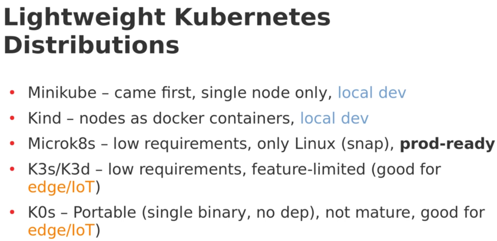
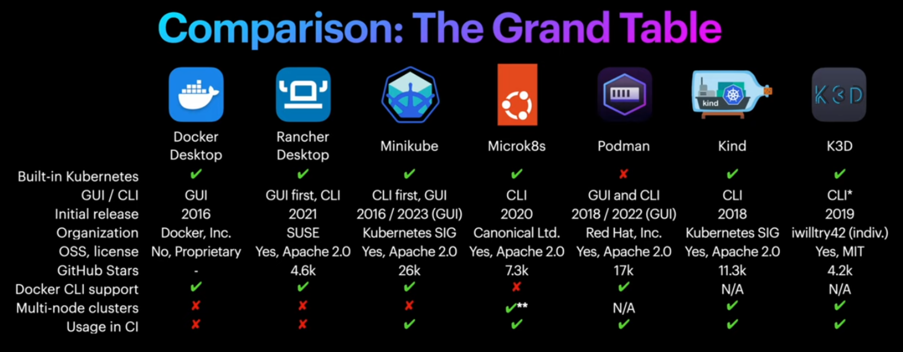

-
- # Multitenant sandbox environment (platform as a service) & Kubernetes toolings to streamline provisioning/deployment
	- ### projects lists & articles resources
		- https://www.cncf.io/projects/
			- https://www.cncf.io/sandbox-projects/
			- https://github.com/cncf/sandbox
		- cloudnativeplatforms.com
	- https://github.com/kubernetes-sigs/agent-sandbox
		-
	- **kcp** https://github.com/kcp-dev/kcp (virtual API server)
	  more modern than vcluster, as it tries to extend Kubernetes in a native way to support multitenancy.
		- multi-tenancy and API isolation through isolated logical clusters (workspaces). A single, shared **kcp** API server is logically segmented into **Workspaces** (logical clusters). Each workspace has its own independent view of cluster-scoped resources (like CRDs) within the shared API server process.
			- suitable for managing a huge number of tenants.  Optimized for **massive multi-tenancy and providing a unified control plane** for managing many applications, tenants, or even multiple underlying physical clusters. Its low overhead makes it the preferred **Kubernetes API as a Service (APaaS)** or **Control Plane as a Service (CPaaS)**.
			- More secure than Kubernetes namespaces but not inherently designed for untrusted external users (SaaS customers). Isolation by KCP only managed on the control plane (server api, etcd config, etc.), thus the security boundary between untrusted tenants on the same physical cluster is **defined by the underlying Kubernetes data plane security**.
				- #+BEGIN_QUOTE
				  To summarize, hard multi-tenancy for untrusted users requires strict security enforcement on the data plane (where workloads run) through four key measures:
				  1. Network Isolation: Employ Network Policies with a "deny all" default to prevent cross-tenant and control plane communication.
				  2. Workload Sandboxing: Use Sandboxed Containers (e.g., Kata Containers) to give untrusted workloads a dedicated kernel, preventing container escapes from affecting the host or other tenants.
				  3. Resource Quotas: Implement aggressive Resource Quotas and Limit Ranges to prevent any single tenant from monopolizing resources and creating a "noisy neighbor" effect.
				  4. Policy Enforcement: Utilize Admission Controllers (like OPA Gatekeeper or Kyverno) to enforce strict rules, such as denying privileged containers and restricting API usage.
				  #+END_QUOTE
		- Building a **SaaS platform** or **Internal Developer Platform** that gives each tenant/team a fully isolated, cheap, and disposable Kubernetes-like control plane.
		- Allows sharing **APIs** and **CRDs** across multiple tenants
		- subproject https://github.com/kubestellar/kubestellar
		- #+BEGIN_QUOTE
		  Another overlap exists with vCluster from the user point of view: vCluster allows to run small Kubernetes clusters on-top of a bigger cluster, sharing the compute of the latter. kcp and vCluster differ in the isolation model, where vCluster opts for higher isolation, but in return has a two (!) magnitudes higher resource consumption compared to a kcp workspace. With that the solution domain is fundamentally different.
		  #+END_QUOTE
		- better fit for managed Kubernetes Control Plane as a Service.
	- https://github.com/loft-sh/vcluster - creates lightweight, fully functional Kubernetes clusters *inside* a namespace of a host Kubernetes cluster. Each vcluster has its own entire isolated Kubernetes control plane (API server, controller manager, etc.) as a set of pods within shared host cluster namespace, which provides a high degree of isolation.
		- Stronger isolation than KCP but with higher overhead (heavier resource consumption).
		- https://github.com/loft-sh/loft is the commercial product build on-top of opensource engine loft/vcluster .
		- Can the isolated vcluster share resources with the host Kubernetes cluster?
			- ? Sync feature - https://github.com/loft-sh/vcluster/blob/main/generic-sync-examples/cert-manager/config.yaml
				- https://github.com/loft-sh/vcluster-generic-crd-sync-plugin
			- Sync plugins (like generic-crd-sync-plugin) allow custom control over which resources to share with the host cluster.[](https://vcluster.com/docs/vcluster/introduction/architecture/)
		- **Workloads scheduled on shared host nodes** for maximum efficiency, or **dedicated nodes** for physical separation.
		- **CRD & resource sync** allows integration with host-level services and cross-vCluster communication when needed.[](https://www.vcluster.com)
	- https://github.com/projectcapsule/capsule
		- https://projectcapsule.dev/
		- policy-based single cluster soft-security multi-tenancy using namespace-grouping approach enforced via admission controllers, policies, quotas, and RBAC on shared cluster control plane & resources.
	- https://coolify.io/docs
	- **KubeSphere**: For a more all-in-one solution, KubeSphere is an open-source, enterprise-grade container platform built on Kubernetes. It provides a rich user interface and a comprehensive set of features for multi-tenancy, observability, and application lifecycle management out of the box.
		- https://kubesphere.io/  https://github.com/kubesphere/kubesphere
	- https://www.rancher.com/
	- https://github.com/karmada-io/karmada
	- https://github.com/kcp-dev/kcp
	- https://github.com/kubestellar/kubeflex - dedicated Kubernetes control planes for each tenant; not popular.
	- https://github.com/kubernetes-sigs/karpenter - Dynamically launches optimal nodes for pending workloads (marked as unschedulable).
		- **Karpenter** — fast node provisioning (better responsiveness than classic cluster-autoscaler in many cloud setups). Use with node pools optimized per sandbox/microVM profile.
	- ~~https://www.devspace.sh/docs/getting-started/introduction~~ - alternative to skaffold
	- Firecracker
	- **Cluster API (CAPI)** specialied tool for kubernetes cluster management — declarative lifecycle for *actual* Kubernetes clusters (create, upgrade, delete clusters programmatically). Important for operating many execution clusters.
		- https://cluster-api.sigs.k8s.io/  - manage cluster lifecycle
		- https://github.com/kubernetes-sigs/cluster-api
		- providers list https://cluster-api.sigs.k8s.io/reference/providers
		- related SIG projects https://github.com/kubernetes/community/tree/master/sig-cluster-lifecycle#readme
		- clusterctl (just like kubectl)
		- #+BEGIN_QUOTE
		  The difference between Cluster API (CAPI) provisioning and the Terraform Kube-Hetzner project fundamentally lies in their operational paradigm and lifecycle management model. While both use a declarative approach to provision Kubernetes clusters on Hetzner, CAPI enforces a continuous reconciliation model, whereas Terraform uses a run-once/execute-on-change workflow.
		  #+END_QUOTE
		- **Cluster API Add-on Provider for Helm (CAAPH)**: This project extends Cluster API to manage the installation, configuration, upgrade, and deletion of cluster add-ons using standard **Helm** charts.<!----><!---->
		- https://github.com/syself/cluster-api-provider-hetzner?tab=readme-ov-file
		- **Rancher** provides an official integration with Cluster API through an extension/operator called **Rancher Turtles** (or SUSE Rancher Prime Cluster API Extension).
	- **Crossplane** https://github.com/crossplane/crossplane generalized tool for external resource management — provision cloud infra (RDS, buckets, network) via Kubernetes API so infra + apps use the same control plane patterns. Helpful for consistent multi-cloud provisioning.
		- Install Crossplane if you plan to provision cloud infra via Kubernetes: Crossplane allows you to provision cloud resources declaratively (databases, object stores) as Kubernetes CRs.
		- Crossplane is  a control plane in Kubernetes, while Terraform is a CLI tool. Crossplane moves the logic for provisioning, connection, and lifecycle management *from* your fragile external scripts and CI/CD pipeline *into* a persistent, self-healing **control plane** within Kubernetes; You define a single, canonical API (**Composite Resource Definition**), and the platform logic in the **Composition** handles all the complex, environment-specific variations, reducing the amount of raw YAML and custom patching logic for your application teams.
		- To achieve a true end-to-end GitOps workflow, Crossplane is typically paired with a dedicated GitOps tool like **Argo CD** or **Flux CD**.
		- To manage self-hosted resources, platform engineers use custom providers: provider-helm, provider-kubernetes (raw objects), and then Composition using the providers to instantiate the instances. The developers then request a CompositeResourceClaim.
			- e.g. use crossplane compositions to create CNPG kubernetes resources which then the developer request instance of that the crossplane engine translates that into CNPG Cluster resource.
	- serverless stateless solutions: https://knative.dev/docs/  vs OpenFaaS https://www.openfaas.com/, Kubeless, Fission, OpenFunction;
		- *auto-scaling*, *ephemeral*, *event-driven* container environments.
	- **Karmada** for Kubernetes multicluster orchestration/federation employing centralized control plane for management of multiple clusters for consistent policy, workload distribution, and user provisioning at scale.
		- Karmada runs its own control plane which can be controlled using kubectl (fully compatible with native Kubernetes API).
		- Adds cluster wide orchestration functionality & policies.
			- PropagationPolicy, OverridePolicy, etc.
			- High Availability and Failover: Karmada enables **cross-cluster failover** and **load balancing** for high availability and disaster recovery scenarios. If a cluster fails, it can automatically reschedule workloads to healthy clusters.
			- Global Resource View: It aggregates the status and resources from all managed clusters, giving you a comprehensive, global view of your entire infrastructure.
		- alternatives: OCM, https://github.com/kubewharf/kubeadmiral, Rancher Fleet,
	- ### additional aspects:
		- **Argo CD (GitOps)** — manage app deployments across many clusters (App of Apps pattern) and drive safe rollouts. Use Argo Projects + RBAC for multi-tenant scopes.
			- Install GitOps controller on management cluster (control plane for apps): Install your GitOps control (the management instance of your GitOps tool) into the management cluster. This instance will be used to bootstrap platform components and/or to orchestrate deployments across clusters.
		- **[KubeVela](https://kubevela.io/)** following **Open Application Model** https://oam.dev/
			- simplifies deploying and operating applications across hybrid multi-cloud environments using declarative workflow.
		- **KEDA** — event-driven autoscaling for queues, builds, or anything with an external metric (e.g., number of pending dev sessions, build queue length). It integrates with HPA.
		- **Thanos (or Cortex)** — scale Prometheus across clusters/regions and provide global query and long-term retention for metrics at scale. Essential at millions-of-users.
		- **Firecracker / Kata / gVisor** — microVMs (Firecracker) or strong runtime isolation (Kata/gVisor). Use RuntimeClass to allow selecting isolation per-tenant. Firecracker is proven for high-density microVMs but requires custom integration.
		- ### Multicluster
			- approaches:
				- Sharded clusters
					- *Shard by region + tenant class* and manage via Cluster API + Crossplane + Argo CD. Use vcluster where you want self-service virtual clusters rather than many extra real clusters. This pattern is what many scale teams adopt because it balances autonomy with manageability.
				- federation / single control plane across clusters
			- Use a *composition* of autoscaling primitives: **warm pools** for instant interactivity, **pod autoscaling (HPA/KEDA)** and **fast node provisioning (Karpenter)** for dynamic capacity.
			- **Shard by geography + tenancy class** (free/dev vs paid/prod) so noisy neighbors and abuse don’t domino.
			- Use a small global **control plane** + many **regionally-sharded execution clusters** (or cluster pools) to contain blast radius, reduce latency, and parallelize ops.
				- solves Kubernetes control plane scalability limits on API request thorughput, etcd performance, and cluster size.
				- ~~Federation / Control Planes for centralized control https://github.com/kubernetes-retired/kubefed~~
				  [deprecated]
			- features non-standard https://github.com/kubernetes/community/tree/master/sig-multicluster#subprojects
			- #+BEGIN_QUOTE
			  - Don’t run one giant cluster for everything. Use a small global control plane + many regionally-sharded execution clusters (or cluster pools) to contain blast radius, reduce latency, and parallelize ops.
			  - Shard by geography + tenancy class (free/dev vs paid/prod) so noisy neighbors and abuse don’t domino.
			  - Use a composition of autoscaling primitives: warm pools for instant interactivity, pod autoscaling (HPA/KEDA) and fast node provisioning (Karpenter) for dynamic capacity.
			  - Use microVMs or runtime classes (gVisor/Kata/Firecracker) for stronger isolation for untrusted workloads.
			  - Automate cluster lifecycle and infra-as-code with Cluster API + Crossplane; deploy apps via GitOps (Argo CD).
			  - Use virtual clusters (vcluster) where you want developer kubectl-like UX without full clusters.
			  - Plan observability and long-term metrics from day-one with Thanos/Cortex for Prometheus scale. 
			  #+END_QUOTE
			- **Multi-cluster Management** - Methods for data plane (workload) cluster integration:
				- https://multicluster.sigs.k8s.io/ - how to run/manage services/applications on multiple existing clusters.
					- **Multi-Cluster Services (MCS):** A specification for discovering and accessing services that exist in different clusters as if they were local. This is a standard defined by the Kubernetes SIG-Multicluster. Tools implementing this API (like Submariner or certain CNI plugins) use **ServiceExport** and **ServiceImport** CRs to allow services to be available across a defined group of clusters (a **ClusterSet**).<!----><!---->
					- **Work API (`work.k8s.io`):** A project that provides a way to represent and distribute any Kubernetes-style resource to multiple clusters from a central "hub" cluster.
				- ### cross-cluster networking/service discovery (unified network across clusters):
					- Cilium Cluster mesh, MCS API implementations, Submariner.
				- ### Workflow/Configuration distribution (central deployment of applications/policies across clusters)
					- Karmada, Open Cluster Management (OCM), GitOps (Flux or ArgoCD) supporting multicluster capabilities.
				- ### Centralized observability
					- prometheus/Grafana (with remote-write), centralized ELK/Loki stack.
		- network isolation using Cilium NetworkPolicy.
		- **Argo CD**, **Flux**, **Tekton** — GitOps + CI pipelines. Argo has multi-tenant installation patterns.
			- **Argo CD** — GitOps for apps and tenant manifests (supports multi-tenant installation patterns.
		- Kubecost
		- **Policy / admission**: **PodSecurity Admission** (built-in, replaces PSPs) + **Kyverno** (policy-as-Kubernetes-CRDs, actively maintained) for mutation/validation. (Kyverno and OPA/Gatekeeper are both options; Kyverno offers Kubernetes-native rules/CRDs.)
			- Open Policy Agent (OPA) with Gatekeeper: OPA is an open-source, general-purpose policy engine. Gatekeeper is a Kubernetes-native project that integrates OPA with the cluster's admission controller.``
			-
		- **Warm pool manager**: run a controller (simple Deployment) that keeps N pre-created sandbox pods per region/runtime image in a sleep/paused state. When a user launches, reassign a warm pod into their namespace (or quickly clone it using COW filesystem snapshot).
		  id:: 68e25530-264d-462a-a8d3-f919a33dde8d
			- **Image layering & COW**: build images with a shared base (Nix/OCI) and use overlayfs or copy-on-write to quickly materialize user state. Replit uses Nix for reproducible environments — adopting Nix/OCI layering speeds starts.
			- **Pool autoscaling**: KEDA for event-based triggers (queue length, request rate) + custom metrics to scale warm pools. For node provisioning accelerate with **Karpenter** for fast node creation.
			- #+BEGIN_QUOTE
			  You can implement the pool manager as a Kubernetes Operator (custom controller) that:
			  - Maintains pool CRD entries (image, runtimeClass, desiredCount).
			  - Watches user requests, maps warm pod -> namespace (or clones via fast snapshot).
			  - Recycles pods after timeout or suspicious activity.
			  #+END_QUOTE
			- Sandbox orchestration: Custom K8s Operator (warm pools)
		- Runtime isolation
			- Firecracker (based on hardware virtualization KVM to run microVMs);
				- Firecracker is positioned as next-generation of Kata. Allows Containerd to manage [containers](https://www.sdxcentral.com/cloud/containers/) as microVMs.
			- Kata on kubernetes over https://github.com/cri-o/cri-o (docker alternative runtime) or Kata on firecracker
		- autoscaling: HPA & VPA autoscalers, KEDA event driven
		- observability: Fluentd or Loki wtih ra, Prometheus & Grafana,
			- **Observability:** Per-cluster Prometheus + Thanos for global queries; Fluent Bit/Fluentd for logs.
		- #+BEGIN_QUOTE
		  kcp complements CNCF graduated/incubating projects like Crossplane, ArgoCD, KubeVela, Operator Framework, and OpenKruise in providing ways to leverage K8s APIs (CRDs) for all software-defined infrastructure; as well as sandbox projects like cdk8s, KUDO, and PipeCD and other open source projects like Kratix.
		  #+END_QUOTE
			- **Operator Framework:** An open-source toolkit designed to effectively, automatically, and scalably manage complex, stateful Kubernetes-native applications, known as Operators.
			- **OpenKruise:** An extended component suite for Kubernetes that extends it with advanced features like in-place updates, flexible deployment strategies, and high-availability protection for large-scale application management. https://github.com/openkruise/kruise
		- **Submariner** provides L3 connectivity across your multiple clusters (multi-cloud/hybrid).
		- Commercial product: https://backstack.dev/intro/
		- #+BEGIN_QUOTE
		  Recommended open-source components (modern, actively maintained)
		  
		  These are categories and example projects you can evaluate and adopt. Use what fits your stack/ops model.
		  - Cluster lifecycle & infra: Cluster API (provision workload clusters from management plane), Crossplane (optional: declarative cloud infra).
		  - GitOps: Argo CD or Flux (use App-of-Apps pattern; register clusters as targets or bootstrap local agents).
		  - Node autoscaling & provisioning: Karpenter (fast node provisioning) or cloud autoscalers where appropriate.
		  - Sandbox runtime: RuntimeClass → gVisor (light), Kata Containers (VM-like), microVMs (Firecracker) for higher isolation — make runtime pluggable.
		  - Policy & admission: PodSecurity Admission + Kyverno (policy as CRDs) or OPA/Gatekeeper depending on team skillset.
		  - Network & security: Cilium (eBPF networking, NetworkPolicy enforcement, optional multi-cluster mesh), Submariner (if you need L3 pod networking across clusters), or service mesh multi-cluster (Istio/Linkerd) where needed.
		  - Warm pools & operators: Custom Kubernetes operator for warm-pool lifecycle (CRDs to define pools, autoscaling, reclamation).
		  - Event autoscaling: KEDA for event-driven scaling of queue/process workers.
		  - Observability & logging: Prometheus (local) + Thanos or Cortex (global aggregation), Fluent Bit → Loki/ELK (logs), Jaeger/Tempo (tracing).
		  - Secrets: HashiCorp Vault or External Secrets Operator (pull secrets from central store into clusters securely).
		  - Image & vulnerability scanning: Trivy (scan images during CI & admission).
		  - Cost & chargeback: Kubecost or OpenCost for chargeback and per-tenant cost tracking.
		  #+END_QUOTE
	- ### Questions
		- Do CAPI spawned clusters integrate with each other?
			- by default they are independent (although spawned from the central bootstrap cluster which managed their deployment);
			- Additional multicluster management tools required to integrate CAPI-provisioned clusters.
		- Bootstrap management cluster's job?
			- It is the intial bootstrap temporary cluster used only in the first step to deploy the CAPI controllers & initial configuration for the first production-ready cluster.
			- Afterwards the responsibility for ongoing reconciliation is moved to the first production-ready workflow cluster (becomes the permanent management cluster).  Or it can be moved to a dedicated management cluster.
		- Can CAPI (Cluster API) replicate Kube-Hetzner setup (K3S + MicroOS) ?
			- Cluster API Provider Hetzner (CAPH)  infrastructure provider + CAPK Bootstrap/Control Plane Provider + CAPI machine configuration settings to specify OpenSUSE MicroOS image.
				- Referencing in CAPH: The Cluster API Provider Hetzner (CAPH) is configured via Kubernetes Custom Resources. To reuse the snapshot, you specify its name (or ID) in the HCloudMachineTemplate object's configuration, usually using the template.spec.imageName field.
		- Which tools implement Cluster API?
			- many tools are compatible with cluster API and provide extensions for it. Others are providers that implement it for specific cloud provider.
		- Is CAPI a standard in Kubernetes or an experimental project?
			- mature, production ready project.
		- Distinction between GitOps / Crossplane approaches & Skaffold cli approach?
			- Skaffold focuses on the inner loop (local development and rapid iteration).
			- GitOps/Crossplane focuses on the outer loop (CI/CD, production deployment, and infrastructure management).
				- Crossplane aligns with GitOps principles (ideal part for infrastructure using GitOps workflow) - infrastructure is defined as Kubernetes Custom Resources where crossplane constantly reconsiles them (CRs, XRDs, Compositions). Those are easily stored in Git to reflect the desired state.
		-
	- ### Resources:
		- TODO https://www.coreweave.com/blog/coreweave-and-loft-labs-leverage-vcluster-in-kubernetes-at-scale
		- TODO https://www.vcluster.com/blog/vcluster-shared-platform-stack
		- TODO [ How to Build a Kubernetes Platform with vCluster and GitOps ](https://www.youtube.com/watch?v=7p1GdyS7kmA)
		- TODO https://gokulchandrapr.medium.com/kata-containers-on-kubernetes-and-kata-firecracker-vmm-support-28abb3a196e7
		- TODO https://controlplane.com/community-blog/post/kubernetes-multi-tenancy
		- TODO https://blog.crossplane.io/crossplane-vs-terraform/
		- TODO [CNCF Project #31](https://www.youtube.com/watch?v=LBGPjoGgdqE&list=PL2We04F3Y_43suyhnm9EEEnCifvCqG5Er) - kubernetes tools CNCF projects
		- TODO https://www.vcluster.com/blog/understanding-kubernetes-multi-tenancy-models-challenges-and-solutions
		- DONE https://github.com/cncf/sandbox/issues/47
		- TODO https://cloudnativeplatforms.com/fr/blog/clusters-for-all-cloud-tenants/
		- TODO https://nirmata.com/2025/02/07/kubernetes-policy-comparison-kyverno-vs-opa-gatekeeper/
		- TODO [ Kubernetes Platform User Journeys & SLOs ](https://www.youtube.com/watch?v=mhkIWti1iy8)
		- TODO [ Why Kubernetes Is Inappropriate for Platforms, and How to Make It Better ](https://www.youtube.com/watch?v=7op_r9R0fCo)
		- TODO [ How to Build Cloud-Native Platforms with Kubernetes | Piotr Zaniewski | Conf42 Platform Eng. 2024 ](https://www.youtube.com/watch?v=HQNeAZUXzbk)
	- ### Conclusion
		- Cluster API + Crossplane + ArgoCD + container isolation (Kata?) + KCP + KubeVela? + Karmada? + Cillium network isolation
		-
	-
- ## Tools -  Github automation merging PRs:
	- auto-merge PR when checks are done using Github Apps (either hosted or locally run) - check the marketplace for apps
		- [GitHub - mergeability/mergeable: 🤖 All the missing GitHub automation 🙂 🙌](https://github.com/mergeability/mergeable) (easy installation, mature) vs  [GitHub - palantir/bulldozer: GitHub Pull Request Auto-Merge Bot](https://github.com/palantir/bulldozer) (self-hosted container, mature) vs [GitHub - bobvanderlinden/probot-auto-merge: A GitHub App built with Probot that automatically merges pull requests](https://github.com/bobvanderlinden/probot-auto-merge) (not anymore active)
		- + combining Github actions for missing features (such as waiting for non-required triggered checks) [GitHub](https://github.com/marketplace?query=wait+check) [GitHub - poseidon/wait-for-status-checks: GitHub Action that waits for check runs](https://github.com/poseidon/wait-for-status-checks)
	- [note: the options provided by Github are not flexible enough to support monorepos with sub-services, thus this feature will not provide a solution for auto-test and auto-merge PRs] toggle Github Actions permissions: Actions > workflow permissions > Allow GitHub Actions to create and approve pull requests  + Read and write permissions; repeat settings for organization-level if required.
		- add test workflow to required checks for the target repository in-order to show "auto-merge" button with specifying each job required to run (workflow dependency only possible with Enterprise account).
		- [possible only on enterprise add "Require workflows to pass before merging" on the organization-level settings for the target repo.
	- Looking into replacing Github Apps with Github Actions from marketplace, many older github apps are no longer needed with Github feature supporting "automerge" button feature.
		- [GitHub - alexwilson/enable-github-automerge-action: Speed up your workflows by automatically enabling Auto-Merge in your Github pull-requests, so you can release when ready.](https://github.com/alexwilson/enable-github-automerge-action)
		- [GitHub - peter-evans/enable-pull-request-automerge: A GitHub action to enable auto-merge on a pull request](https://github.com/peter-evans/enable-pull-request-automerge?tab=readme-ov-file#conditions)
		- [GitHub - pascalgn/automerge-action: GitHub action to automatically merge pull requests that are ready](https://github.com/pascalgn/automerge-action?tab=readme-ov-file)
	- Conclusion: use workflow [GitHub - poseidon/wait-for-status-checks: GitHub Action that waits for check runs](https://github.com/poseidon/wait-for-status-checks) to support enforcing triggered tests (that are not required in repo settings) + use [GitHub - pascalgn/automerge-action: GitHub action to automatically merge pull requests that are ready](https://github.com/pascalgn/automerge-action?tab=readme-ov-file) to automerge PRs with options to target specific PRs.
-
- <!--ScriptorStartFragment-->
- ### Misc:
	- [Google's Git Killer Is INSANELY Better (and it's open source)](https://www.youtube.com/watch?v=cZqFaMlufDY&ab_channel=DevOpsToolbox)
-
- ---
- <!--ScriptorStartFragment-->
- # CI/CD
	- release-please tool to release builds in Github maintain versioning in Git.
	- [GitHub - jbolda/covector: Transparent and flexible change management for publishing packages and assets.](https://github.com/jbolda/covector) for version management used by Tauri
	- ArgoCD to sync Kubernetes with container registry and then update Git repo kubectl/kustomize version.
	- TODO: check approaches to update kustomize versions following release-please deployment.
	  
	  ```
	  currently the version for production is set in kustomize overlays/prod/kustomization.yaml file
	  
	  apiVersion: kustomize.config.k8s.io/v1beta1 kind: Kustomization resources: - ../../base images: - name: web-server newTag: v0.0.82 # x-release-please-version
	  
	  How to keep this version synchronized ? suggest better approaches to handling container release versions.
	  Recommend production ready appraoches to synchronize versions between release-please and deployment configs.
	  ```
	- [Introduction to dev containers - GitHub Docs](https://docs.github.com/en/codespaces/setting-up-your-project-for-codespaces/adding-a-dev-container-configuration/introduction-to-dev-containers)
- ---
- ## Deploy - serve web SPA
	- using a web server microservice with NGNIX configured to serve files and fallback to index.html for app routing files (which would be CSR to view proper page).
	- NGINX (tested heavily and featureful for the task) vs Axum as web-server (manual implementation with less optimization)
	- SPA served over CDN.
	- conclusion: use web-server behind a reverse proxy (maps root domain to static SPA asset files). In Kubernetes there is support for Ingress Ngnix controller which acts a reverse-proxy to external traffic intor the cluster.
- ---
- ### Docker, Kubernetes:
- ~~docker desktop~~ (unnecessary extralayer VM of abstraction) vs docker engine CLI.
- use dockerfile for containerizing applicaiton and Kubernetes configs for setting up clusters both for local and prod (avoid docker compose altogether).
- Implementaions of Kubernetes
	- 
	- 
	- **Minikube**: single node cluster, very powerful but slower to setup. heavier setup. most popular.
	- K3s + Rancher (by default runs nodes on docker): great CI pipelines, targeted to edge-devices production, may change local OS configuration (thus must be ran under vm or docker).
		- vs k30
	- [Load testing for engineering teams | Grafana k6](https://k6.io/)
	- k9s
	- [GitHub - ahmetb/kubectx: Faster way to switch between clusters and namespaces in kubectl](https://github.com/ahmetb/kubectx)
	- Kind (Kubernetes in docker - i.e. runs docker Kubernetes inside another docker): more powerful multi-node cluster, Very fast, possible to run multi-node emulated cluster. harder configuration.
	- ~~Docker Desktop~~: single node cluster, easy setup, runs in a vm (extra layer of abstraction); vs [Rancher Desktop by SUSE](https://rancherdesktop.io/)
	- Kubernetes's Kubeadm: powerful multi-node cluster with more features,
	- + visualizations: [Deploy and Access the Kubernetes Dashboard](https://kubernetes.io/docs/tasks/access-application-cluster/web-ui-dashboard/) + [Lens | The Kubernetes IDE](https://k8slens.dev/) + vscode extension
	- Rancher: allows to manage multiple clusters of Kubernetes.
	- Tilt for local live dev in Kubernetes cluster (works with minikube too) [First Look at Tilt](https://docs.tilt.dev/tutorial/index.html)
		- vs. Skaffold (15k, local + remote + devops integration deployment, supports multiple configurations, file sync), Tilt (8k, Starlark config format, specifically designed for local development, immediate live application updates, file sync, reload app script, debugging inspection port forwarding, local dev only, supports single titlefile in root with .starlark modules; fine grained control over changes and what they trigger), Devspace (4.5k), and Okteto (partial open source) vs garden (free-tier plan)
	- Kpt (too complex and documentation written academically and not for practical usage) vs kustomize vs helm
		- check [Kpt [NEW]](https://skaffold.dev/docs/renderers/kpt/)
	- https://kubevirt.io/ allows running virtual machines alongside containers.
-
- <!--ScriptorStartFragment-->
- ### resources:
	- DONE [The Single-Node Kubernetes Showdown: minikube vs. kind vs. k3d | Oilbeater's Study Room](https://oilbeater.com/en/2024/02/22/minikube-vs-kind-vs-k3d/)
	- DONE [Skaffold vs Tilt vs DevSpace](https://www.loft.sh/blog/skaffold-vs-tilt-vs-devspace)
	- DONE [Devspace vs  Skaffold: Simplify Java Development in the Kubernetes World  By  Ana Maria Mihalceanu](https://www.youtube.com/watch?v=Q-jilSBje2A)
	- DONE [Develop cloud-native software faster with DevSpace | DevOps Tool of the Month (1)](https://www.youtube.com/watch?v=kgfg8r6_zPk&t=29s)
	- DONE [Tilt In Two Minutes](https://www.youtube.com/watch?v=FSMc3kQgd5Y)
	- DONE [Tilt for Kubernetes: Streamline Your Development Workflow](https://www.youtube.com/watch?v=JRc967vAkGM)
	- DONE [Skaffold vs Tilt: Your Guide to Local Kubernetes Development](https://www.wallarm.com/cloud-native-products-101/skaffold-vs-tilt-local-kubernetes-development)
	- DONE [Development Environments Made Easy With Tilt Rebuilds And Live Updates](https://www.youtube.com/watch?app=desktop&v=fkODRlobR9I&t=0s)
	- DONE [Application Development With Local Kubernetes | CodiLime](https://codilime.com/blog/application-development-local-kubernetes/)
	- DONE [Deploying Your Apps to Kubernetes Without the Boilerplate - Marc Nuri & Roland Huß, Red Hat](https://www.youtube.com/watch?v=uk7mpCdIIZc)
	- DONE [Local Kubernetes Development - Tilt and TurboRepo Hot Reloading](https://www.youtube.com/watch?v=wHgqMVkPcJs)
	- summary of Kubernetes tools [Kubernetes Tools: Minikube, kind, skaffold, tilt, devspace and their place in the development process](https://cloudomation.com/en/cloudomation-blog/kubernetes-tools/)
	- DONE [Using Skaffold to accelerate Microservice Development](https://www.roccolangeweg.com/using-skaffold-to-accelerate-microservice-development/)
	- DONE [https://www.reddit.com/r/kubernetes/comments/1fvx6m0/its_a_good_practice_to_use_a_single_generic_helm/](https://www.reddit.com/r/kubernetes/comments/1fvx6m0/its_a_good_practice_to_use_a_single_generic_helm/)
	- Yaml config templating tools[Comparing Configuration Management Tools for Kubernetes: Helm, Kustomize, KPT, and Jsonnet](https://klarrio.medium.com/comparing-configuration-management-tools-for-kubernetes-helm-kustomize-kpt-and-jsonnet-31e14b50063c)
	- DONE [k3s-kustomize-skaffold-k3d-example/k8s/base/deployment.yaml at main · terotuomala/k3s-kustomize-skaffold-k3d-example](https://github.com/terotuomala/k3s-kustomize-skaffold-k3d-example/blob/main/k8s/base/deployment.yaml)
	- DONE [GitHub - vszal/pop-kustomize: End-to-End Google Cloud CI/CD example repo and tutorial](https://github.com/vszal/pop-kustomize)
	- DONE [Using Skaffold to accelerate Microservice Development](https://www.roccolangeweg.com/using-skaffold-to-accelerate-microservice-development/)
	- DONE [Skaffold Profiles: multi-environment Kubernetes development](https://victorszalvay.com/skaffold-profiles/)
	- [WYSIWYG Config as Data Demo](https://www.youtube.com/watch?v=L_x7z4CXHDw)
	- [https://www.reddit.com/r/kubernetes/comments/1fvx6m0/its_a_good_practice_to_use_a_single_generic_helm/](https://www.reddit.com/r/kubernetes/comments/1fvx6m0/its_a_good_practice_to_use_a_single_generic_helm/)
		- [https://bjw-s.github.io/helm-charts/docs/app-template/](https://bjw-s.github.io/helm-charts/docs/app-template/)
	- DONE [Ultimate Guide to Local Kubernetes Development Tools for 2024](https://www.getambassador.io/blog/best-kubernetes-local-development-tools-guide)
	- DONE [https://www.reddit.com/r/kubernetes/comments/17ux97i/in_real_world_does_local_kubernetes_is_commonly/](https://www.reddit.com/r/kubernetes/comments/17ux97i/in_real_world_does_local_kubernetes_is_commonly/)
	- Microservices history and problems [Microservices, Where Did It All Go Wrong • Ian Cooper • GOTO 2024](https://www.youtube.com/watch?v=j2AQ9eTZ3-0)
	- [Operator pattern](https://kubernetes.io/docs/concepts/extend-kubernetes/operator/)
	-
- portainer dashboard for containers
- **Kustomize **tool for templating kubernetes configurations. [Guides](https://kubectl.docs.kubernetes.io/guides/); it replaces Helm
	- dealing with kustomization and generated names across configs.
- Kustomize vs Helm vs Kpt, vs Jsonnet
	- TODO: consider Kpt instead of Kustomize
- "Ingress" vs newer "Gateway API" (has all ingress functionality and more)
	- Gateway doesn't seem to have support for an addon such as minikube ingress-dns
-
- # Conclusion:
	- Skaffold for development & CI/CD to deployment (possible also Title standalone for development) + Minikube + k9s + K3s (prod)  + ...
	  
	  ---
- <!--ScriptorStartFragment-->
- # Kubernetes cloud platform :
	- Kubernetes CD using [ArgoCD Starter Guide: Full Tutorial for ArgoCD in Kubernetes](https://www.youtube.com/watch?v=JLrR9RV9AFA) [Kustomize - Argo CD - Declarative GitOps CD for Kubernetes](https://argo-cd.readthedocs.io/en/stable/user-guide/kustomize/)
	- Providers
		- GKE - most popular (infrastructure managed Kubernetes platform); vs Google Cloud Run; Barebone self-managed GCE (but cheapest financial cost);
		- Linode: Managed Kubernetes cluster [The World's Most Distributed Cloud Computing Platform | Akamai](https://www.linode.com/) + the build in tools & implementations of loadbalancer and cert-manger
		- AWS: best cloud service with global reach
			- + Cheap spot-VMs instances with automigration [Architect](https://architect.run/)
			- G6 spot instances are powerful and cheapest!
		- Oracle Cloud Infrastructure
		- Cloudflare CDN (optimizing performance with CDN and caching) + cloudflare r2
		- Cheap computing (german company with youtube channel)[Cheap dedicated servers, cloud & hosting from Germany](https://www.hetzner.com/); terraform plugin called kube-hetzner.
			- TODO [https://www.reddit.com/r/hetzner/comments/1dag52h/thanks_hetzner_last_week_i_slashed_my_server/](https://www.reddit.com/r/hetzner/comments/1dag52h/thanks_hetzner_last_week_i_slashed_my_server/)
			- DONE [https://www.reddit.com/r/hetzner/comments/15r5nuy/i_dont_understand_how_its_possible_to_have_such_a/](https://www.reddit.com/r/hetzner/comments/15r5nuy/i_dont_understand_how_its_possible_to_have_such_a/)
			- TODO [How We Develop and Operate Pirsch](https://pirsch.io/blog/techstack/)
		- Digital Ocean
		- [https://contabo.com/en/](https://contabo.com/en/)
		- Bunny CDN
		- Cloudflare Tunnel (exposing application through cloudflare ip/domain).
	- Non-manged solution (self-managed - using kops) vs manged cluster: involves setting up a cluster on nodes and install appropriate dependencies and configurations on them.
	- shared hosting vs dedicated VM vs managed kubernetes
	- DevOps tools infrastructure: Terraform vs Ansible vs Pulumi
	- Compare prices of clouds
		- provides a comparison accross clouds in detail & they ran benchmarks on real spinned instances [Cloud Servers Navigator - Spare Cores](https://sparecores.com/servers)
			- cheap cx22 instance [cx22 by Hetzner Cloud - Spare Cores](https://sparecores.com/server/hcloud/cx22)
		- [About us](https://cast.ai/about-us/)
		- [IBM Kubecost - K8s Cost Monitoring - Apptio](https://www.kubecost.com/)
		- [Amazon EC2 Instance Comparison](https://instances.vantage.sh/)
		- [https://getdeploying.com/](https://getdeploying.com/)
	- Autoscaling solutions: HPA, VPA, Cluster autoscaler (requires config with cloud).  Autoscaling Group from scratch
		- **Cluster Autoscaler**
		- **Karpenter**
		- https://keda.sh/
		-
	- Multi-cloud strategy with on-premise server hosting or self-managed through cheap server hosting and critical services through cloud providers (using serverless functions or CDN etc.); managing kybernetes cluster that spans multiple clouds?
	- explore serverless with Kubernetes or integrate serverless architecture to save costs.
		- TODO [6 Serverless Frameworks on Kubernetes You Need to Know](https://www.appvia.io/blog/serverless-on-kubernetes)
	- Decentralized compute: [Akash Network - Decentralized Compute Marketplace](https://akash.network/) (NOTE: this distributed system is fairly immature but more anonymous); check small cloud providers market
	- Talos Linux: designed for running Kubernetes.
	- ## Other tools:
		- https://github.com/kubescape/kubescape - security scan and misconfiguration detection.
		-
	-
-
- ### resources:
	- DONE [Deploying to Google Kubernetes Engine with GitHub Actions](https://www.youtube.com/watch?v=7NyJWuRHQDA)
	- TODO look at cloud providers in sponsodred section a t [Coolify](https://coolify.io/)
	- TODO [Leaving the Cloud — Cloud Computing Isn’t For Everyone](https://basecamp.com/cloud-exit)
	- DONE [Price Comparison of Managed Kubernetes Solutions for Web-Apps](https://olegcodes.medium.com/price-comparison-of-managed-kubernetes-solutions-for-web-apps-6e658a2f98f2)
	- DONE ~~comparison of managed cloud pricing ~~[Top 4 cheapest managed Kubernetes providers in 2024](https://medium.com/@emilmatyjaszewski/top-4-cheapest-managed-kubernetes-providers-in-2024-fa2776906266)
	- TODO [Migrate from Public Cloud: Building Kubernetes Bare-Metal Infrastructure](https://8grams.medium.com/migrate-from-public-cloud-building-kubernetes-bare-metal-infrastructure-136b74888f34)
	- DONE ~~slicing cost by moving to serverless ~~[Case Study: How Serverless Computing Saved a Startup Thousands on Cloud Costs | SAMO Technologies](https://www.samo.is/blog/case-study/how-serverless-computing-saved-a-statup-thousands-oncloud-cost?utm_source=blog-index)
	- DONE ~~Cast AI ~~[Uncover Kubernetes cost-optimization trends - Philip Andrews](https://www.youtube.com/watch?v=ztqq8UJwUX4)
	- TODO [Kubernetes at Uber Scale : Scaling Thousands of Services and Millions of Containers Daily](https://www.youtube.com/watch?v=H_4j_M_J1Bc)
	- DONE [How to deploy your website to production in 30 minutes](https://www.youtube.com/watch?v=gViEtIJ1DCw)
	- DONE ~~How to setup Kubernetes on base-metal - great guide ~~[Migrate from Public Cloud: Building Kubernetes Bare-Metal Infrastructure](https://8grams.medium.com/migrate-from-public-cloud-building-kubernetes-bare-metal-infrastructure-136b74888f34)
	- DONE [[ Kube 83 ] Kubernetes The Hard Way in Google Cloud Platform](https://www.youtube.com/watch?v=WS1dGY6LosY)
	- TODO [Bill Franklin](https://bilbof.com/posts/kubernetes-on-hetzner)
	-
- # Tools to setup cloud cluster on Hetzner:
	- [GitHub - kube-hetzner/terraform-hcloud-kube-hetzner: Optimized and Maintenance-free Kubernetes on Hetzner Cloud in one command!](https://github.com/kube-hetzner/terraform-hcloud-kube-hetzner)
	- [GitHub - vitobotta/hetzner-k3s: The easiest and fastest way to create and manage Kubernetes clusters in Hetzner Cloud using the lightweight distribution k3s by Rancher.](https://github.com/vitobotta/hetzner-k3s)
	- [Deploying to Hetzner - Beta - kOps - Kubernetes Operations](https://kops.sigs.k8s.io/getting_started/hetzner/)
	- [GitHub - kubermatic/kubeone: Kubermatic KubeOne automate cluster operations on all your cloud, on-prem, edge, and IoT environments.](https://github.com/kubermatic/kubeone) [didn't consider yet]
-
- # conclusion:
	- self-managed Kubernetes cluster on the cheapest provider or VM hosting service + using IaC (infrastructure as code)
		- Hetzner.com
			- project (powerful project, more feature rich than kOps) [GitHub - kube-hetzner/terraform-hcloud-kube-hetzner: Optimized and Maintenance-free Kubernetes on Hetzner Cloud in one command!](https://github.com/kube-hetzner/terraform-hcloud-kube-hetzner): K3s + Terraform + Longhorn + Hetzner Load Balancer (no Kubernetes external load balancer solutions provide full HA+IP reassignment) + ....
			- kOps supports Hetzner in beta + also support producing terraform.
		- Talos Linux
		- MetalLB (in layer-2 mode)
		- Rancher Longhorn (distributed storage (local storages of cluster nodes) - storage-level replication
	- + AWS spot instances
	- + Cloudflare CDN+blob storage
	- + AWS S3 blob storage
-
- For a quick deployment solution rely on cloud managed Kubernetes: **GKE****;**
-
- Issues:
	- kOps error + Hetzner: Encountered error with kOps tool when deployed on Hetzner with a S3-compatible Object Storage by Hetzner.
- ---
- <!--ScriptorStartFragment-->
- # Terraform:
	- calico vs cilium cs flannel
		- cluster mesh vs service mesh
		- hubble ?
	- cloud provider load balancer vs local Kubernetes MetalLB load balancer.
	- Cloudflare R2 object store - e.g. for storing etcd cluster config backups.
		- [use case] 1 master node with backups of etcd configs?
	- Rancher add-ons
	- Helm chart integration:
		- helm adds unnecessary complexity to clear yaml files or kasotmize alternative. Even the package management is not perfect.
		- Helm for releases + Kustomize for templating seems to be a balanced solution.
	- [GitHub - loft-sh/vcluster: vCluster - Create fully functional virtual Kubernetes clusters - Each vcluster runs inside a namespace of the underlying k8s cluster. It's cheaper than creating separate ...](https://github.com/loft-sh/vcluster)
	- WRO vs WRX volumes vs other storage solutions
		- Opensource NextCloud project for personal file sharing cloud.
		- longhorn distributed storage for cluster.
	- ServiceLB/KipplerLB (integrated with K3S, exposes services to node's IP address, software-based) vs MetalLB (supports single external IP assignment to cluster, network-level based - alters routers configs) vs Hetzner Load Balancer on-metal load balancer, that assignes external ip to resource load balancers in the cluster through configuring ip tables on the host nodes.
	- Ngnix (less resource consumption) vs Traefik (more modern + UI, documentations are really bad - many convention assumptions are made for labels, more resource intensive than Nginx)
	- Cloudflare Tunnels (to possibly reduce latency for long-distance visitors)
	- cert-manager let's encrypt
		- certificate challenge types: supports multiple domains (dns01) vs single domain (http-01)
		- utility [GitHub - emberstack/kubernetes-reflector: Custom Kubernetes controller that can be used to replicate secrets, configmaps and certificates.](https://github.com/emberstack/kubernetes-reflector)
	- Kubernetes management tool [K9s - Manage Your Kubernetes Clusters In Style](https://k9scli.io/)
	- Cloudflare terraform export tool cf-terraforming
	- Flux or ArgoCD work in pull-based deployment model which sync changes from repository configurations (apply desired state from repo to actual state on running deployment environment).
		- engineers team members propose changes through pull request, and the CD pipeline tool deploys the changes (no direct engineer executing change directly on the deployment environment).
- # resources
	- DONE [Setting Up a Highly Available Kubernetus Cluster (K3S) on Hetzner Cloud with Terraform](https://medium.com/@mahdad.ghasemian/setting-up-a-highly-available-kubernetus-cluster-k3s-on-hetzner-cloud-with-terraform-7a409a7a8528)
	- TODO [A beautiful GitOps day III - HA storage & DB](https://blog.okami101.io/2023/08/a-beautiful-gitops-day-iii-ha-storage-db/)
	- DONE [What does ServiceLB (Klipper LB) actually do ? · k3s-io k3s · Discussion #9927](https://github.com/k3s-io/k3s/discussions/9927)
	- DONE [[K3s-04] K3s Service LoadBalancer Configuration (Klipper and MetalLB)](https://jaehong21.com/posts/k3s/04-service-lb/)
	- DONE [https://www.reddit.com/r/kubernetes/comments/rkuxlp/whats_the_point_of_metallb_in_a_bare_metal_cluster/](https://www.reddit.com/r/kubernetes/comments/rkuxlp/whats_the_point_of_metallb_in_a_bare_metal_cluster/)
	- DONE [Install a Kubernetes cluster on cloud servers](https://community.hetzner.com/tutorials/install-kubernetes-cluster#step-2---configure-the-network)
	- DONE [https://www.reddit.com/r/hetzner/comments/usfwge/hetzner_load_balancer_and_cloudflare_possible/](https://www.reddit.com/r/hetzner/comments/usfwge/hetzner_load_balancer_and_cloudflare_possible/)
	- DONE ~~Gateway API + cert-manager ~~[Use Kubernetes Gateway API instead of Ingress! (TLS - Cert Manager - Istio - Prometheus)](https://www.youtube.com/watch?v=nJUzGJQR3tM)
	- DONE [ What is GitOps, How GitOps works and Why it's so useful ](https://www.youtube.com/watch?v=f5EpcWp0THw)
- ---
-
- # conclusion:
	- use cloud's load balancer as the solution of implementing an external HA load balancer using 3 control plane nodes in Kubernetes  with the ability to reassign IP address provided by cloud away from a failed node does not exist or require a lot of effort to implement with little added value. Thus, use native load balancer solution to the nodes which takes care of the static IP assigned to the load balancer regardless of node failure.
		- Note: using KipplerLB (ServiceLB) the node's ip can be assigned to a running Kubernetes service. While the Hetzner's cloud load balancer will assign only the ip it created for the load balancer to the kubernetes service. Therefore, the IPv4 attached ips for the servers  can be deleted and only ipv6 free addresses kept for each server.
		- latency to Gemany's Hetzner cloud center is in the 100s of milliseconds; A CDN is a must for deploying the SPA app.
	- Cloudflare registrar service follows a lock-in strategy by preventing to change the nameservers of domains registered through them. Thus a better approach would be to use a separate domain registration service and point nameserver to cloudflare's.
- <!--ScriptorStartFragment-->
  
  ---
- # Storage volumes in Kubernetes:
	- Longhorn (with replication, snapshot, backup capabilities) + Hetzner Cloud Volume (network block storage)
		- Longhorn on local node storage
		- Longhorn on Hetzner cloud storage
-
- ## resources:
	- DONE [Longhorn  hcloud best practices](https://gist.github.com/ifeulner/d311b2868f6c00e649f33a72166c2e5b)
	- DONE [Longhorn | Tip: Set Longhorn To Only Use Storage On A Specific Set Of Nodes](https://longhorn.io/kb/tip-only-use-storage-on-a-set-of-nodes/#create-a-storageclass-that-select-a-specific-set-of-nodes)
- ---
- # Monitoring  & autoscaling :
	- Ppromethus + Grafana + Cilium
	- Goldilocks + Kubernetes Vertical Pod Autoscaler
-
- ## resources:
	- DONE [Deploy Prometheus and Grafana on Kubernetes using Helm](https://medium.com/@gayatripawar401/deploy-prometheus-and-grafana-on-kubernetes-using-helm-5aa9d4fbae66)
	- DONE [How to Install Prometheus and Grafana on Kubernetes with Helm](https://signoz.io/guides/how-to-install-prometheus-and-grafana-on-kubernetes/)
	- TODO [https://semaphoreci.com/blog/prometheus-grafana-kubernetes-helm](https://semaphoreci.com/blog/prometheus-grafana-kubernetes-helm)
	- DONE [Kubernetes LAB 18: kubectl top command to see which node or pod or container is consuming most cpu](https://www.youtube.com/watch?v=6y3BySquqts)
	- DONE [Understanding CPU & Memory with the Kubernetes Vertical Pod Autoscaler](https://www.youtube.com/watch?v=jcHQ5SKKTLM)~~~~